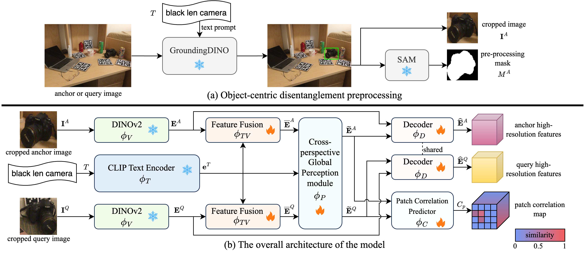

# FiCoP

The official implementations of **Learning Fine-Grained Correspondence with Cross-Perspective Perception for Open-Vocabulary 6D Object Pose Estimation (FiCoP)**: A fine-grained correspondence learning framework for open-vocabulary 6D object pose estimation. It tackles large viewpoint differences via patch-to-patch spatial constraints and explicit cross-view interaction, significantly outperforming existing global matching baselines.

## The framework of FiCoP

  

The paper has been submitted. Once accepted, the relevant code and data of the paper will be released soon! 