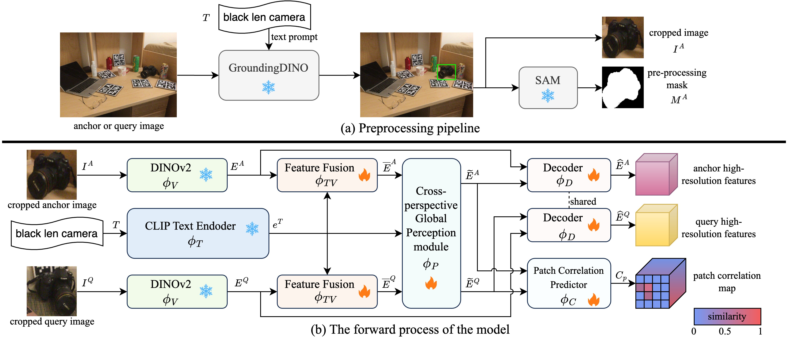

# FiCoP: Learning Fine-Grained Correspondence with Cross-Perspective Perception for Open-Vocabulary 6D Object Pose Estimation

A fine-grained correspondence learning framework for open-vocabulary 6D object pose estimation.

<p align="center">
<a href="https://arxiv.org/abs/2601.13565"></a>
<a href="https://huggingface.co/zjjqinyu/FiCoP/tree/main"></a>
</p>


## Overview


## Environment Configuration

### 1. Installation

- First of all, download `oryon_data.zip` and `pretrained_models.zip` from the [release of Oryon](https://github.com/jcorsetti/oryon/releases).

- Run `setup.sh` to install the environment and download the external checkpoints.

- Activate environment:
  ```bash
  conda activate ficop
  ```

- Install Pytorch:
  ```bash
  pip install torch==1.12.1+cu113 torchvision==0.13.1+cu113 --extra-index-url https://download.pytorch.org/whl/cu113
  ```

- Install pip packages:
  ```bash
  pip install -r requirements.txt
  ```


### 2. Dataset preparation

Please refer to [Oryon](https://github.com/jcorsetti/oryon#dataset-preparation) for dataset preparation.


## Running FiCoP

### Testing

1. Download the [bounding box and mask cache](https://huggingface.co/zjjqinyu/FiCoP/tree/main) of the test dataset predicted by GroundingDINO and SAM to avoid redundant calculations. Alternatively, you can also generate them by running `python ov_models.py`.

2. Download the checkpoint of the trained model from [Hugging Face](https://huggingface.co/zjjqinyu/FiCoP/tree/main).

3. Run the following to test the model:

  - Test the NOCS dataset (default):
    ```bash
    python run_test.py eval.ckpt=exp_data/baseline/models/ficop_epoch0019.ckpt
    ```

  - Test the TOYL dataset:
    ```bash
    python run_test.py eval.ckpt=exp_data/baseline/models/ficop_epoch0019.ckpt dataset.test.name=toyl
    ```

### Training

```bash
python run_train.py exp_name=baseline
```

## Acknowledgements

Thanks for the following repositories, which helps us to quickly implement our ideas:

- [Oryon](https://github.com/jcorsetti/oryon)
- [DINOv2](https://github.com/facebookresearch/dinov2)
- [SAM](https://github.com/facebookresearch/segment-anything)
- [GroundingDINO](https://github.com/IDEA-Research/GroundingDINO)


## Citation

If our work is useful for your research, please consider citing:

```bibtex
@ARTICLE{ficop,
  author={Qin, Yu and Fan, Shimeng and Yang, Fan and Xue, Zixuan and Mai, Zijie and Chen, Wenrui and Yang, Kailun and Li, Zhiyong},
  journal={IEEE Robotics and Automation Letters}, 
  title={Learning Fine-Grained Correspondence With Cross-Perspective Perception for Open-Vocabulary 6D Object Pose Estimation}, 
  year={2026},
  volume={11},
  number={9},
  pages={10090-10097},
  doi={10.1109/LRA.2026.3711484}}
```
